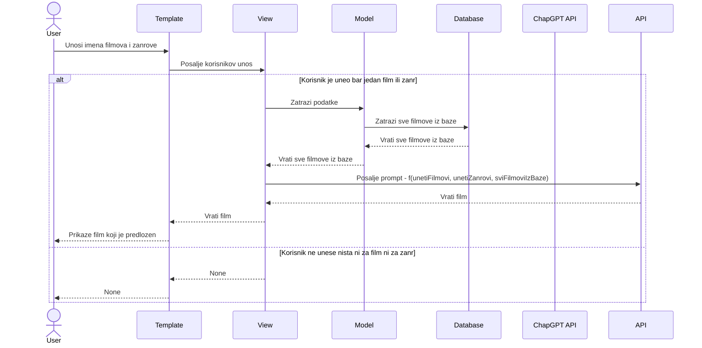

autor: Nikola Ostojić

```mermaid
sequenceDiagram
    actor User
    participant Template
    participant View
    participant Model
    participant Database
    participant ChapGPT API

    User->>Template: Unosi imena filmova i zanrove
    Template->>View: Posalje korisnikov unos
    alt Korisnik je uneo bar jedan film ili zanr
        View->>Model: Zatrazi podatke
        Model->>Database: Zatrazi sve filmove iz baze
        Database-->>Model: Vrati sve filmove iz baze
        Model-->>View: Vrati sve filmove iz baze
        View->>API: Posalje prompt - f(unetiFilmovi, unetiZanrovi, sviFilmoviIzBaze)
        API-->>View: Vrati film
        View-->>Template: Vrati film
        Template-->>User: Prikaze film koji je predlozen
    else Korisnik ne unese nista ni za film ni za zanr
        View -->>Template : None
        Template-->>User: None
    end
```